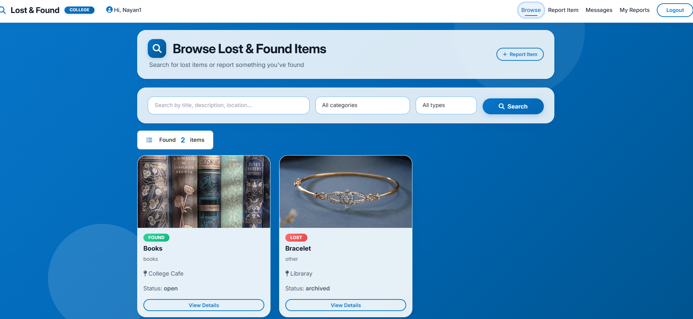
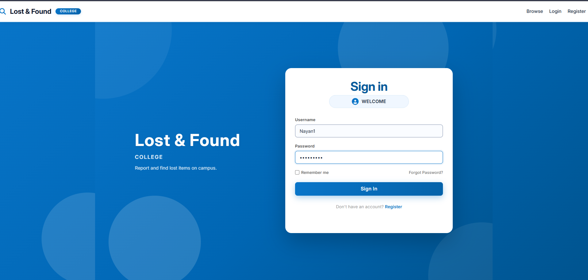
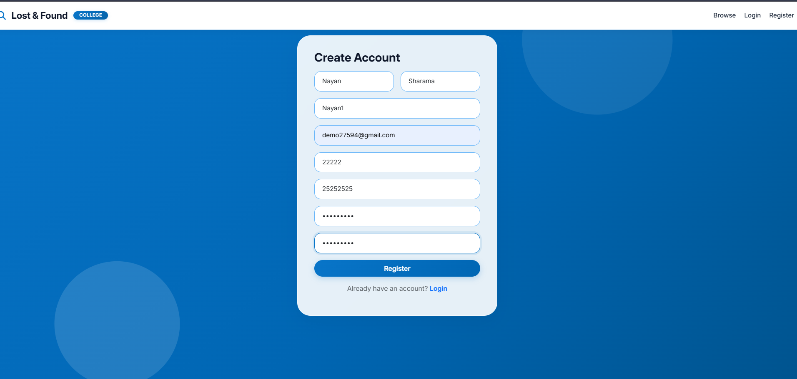
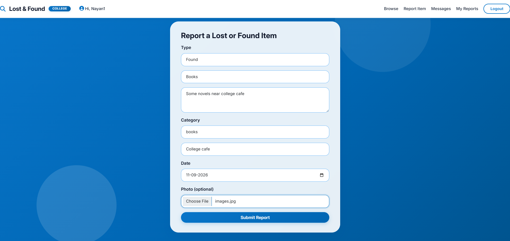
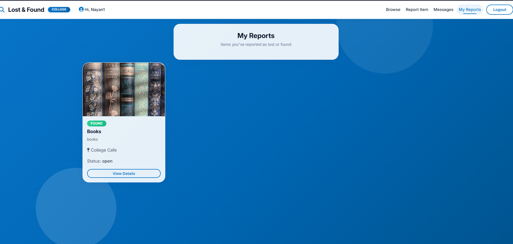
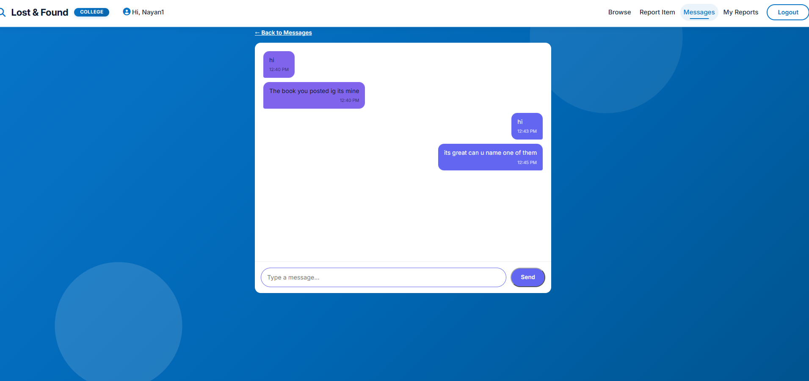

# College Lost & Found Management System

A full-stack web application that helps college students report, search, and recover lost and found items such as ID cards, books, wallets, and electronic devices.

## Features

- User registration and login
- JWT-based authentication
- Report lost and found items
- Upload images of items
- Search and filter items
- Track item status
- View personal reports
- View reporter contact information
- Admin panel for managing users and items
- Protected routes and user permissions
- Responsive user interface

## Screenshots

### Home Page



### Login Page



### Registration Page



### Post Lost or Found Item



### Your Reports



### Chat



### Admin Panel


## Tech Stack

### Frontend

- React.js
- React Router
- Axios
- Bootstrap 5
- Vite
- JavaScript
- CSS

### Backend

- Python
- Django
- Django REST Framework
- Simple JWT
- MySQL
- Pillow
- django-cors-headers
- django-filter

## Project Structure

```text
Lost_Found/
│
├── back_manage/
│   ├── accounts/
│   ├── backend/
│   ├── items/
│   ├── media/
│   ├── .env.example
│   ├── manage.py
│   └── requirements.txt
│
├── front_manage/
│   ├── src/
│   │   ├── api/
│   │   ├── components/
│   │   ├── context/
│   │   ├── pages/
│   │   ├── App.jsx
│   │   ├── index.css
│   │   └── main.jsx
│   ├── index.html
│   ├── package.json
│   └── vite.confug.js
│
├── Images/
│   ├── admin pannel.png
│   ├── chats.png
│   ├── home_page.png
│   ├── login.png
│   ├── post.png
│   ├── register.png
│   └── your_report.png
│
├── .gitignore
└── README.md
```

## Installation

### Clone the Repository

```bash
git clone https://github.com/SimranArya16/Lost_Found.git
cd Lost_Found
```

## Backend Setup

Navigate to the backend folder:

```bash
cd back_manage
```

Create a virtual environment:

```bash
python -m venv venv
```

Activate the virtual environment:

```bash
venv\Scripts\activate
```

Install the required dependencies:

```bash
pip install -r requirements.txt
```

Create a `.env` file using `.env.example` and add your database configuration.

Run database migrations:

```bash
python manage.py migrate
```

Create an admin account:

```bash
python manage.py createsuperuser
```

Start the backend server:

```bash
python manage.py runserver
```

Backend server:

```text
http://127.0.0.1:8000/
```

## Frontend Setup

Open a new terminal and navigate to the frontend folder:

```bash
cd front_manage
```

Install the required dependencies:

```bash
npm install
```

Start the frontend development server:

```bash
npm run dev
```

Frontend server:

```text
http://localhost:5173/
```

## API Endpoints

| Method | Endpoint | Description |
|--------|----------|-------------|
| POST | `/api/accounts/register/` | Register a new user |
| POST | `/api/accounts/login/` | User login |
| POST | `/api/accounts/login/refresh/` | Refresh JWT token |
| GET | `/api/accounts/me/` | Get current user |
| GET | `/api/items/` | Get all items |
| POST | `/api/items/` | Create an item report |
| GET | `/api/items/{id}/` | Get item details |
| PATCH | `/api/items/{id}/` | Update an item |
| DELETE | `/api/items/{id}/` | Delete an item |
| GET | `/api/items/my_reports/` | Get user's reports |

## Search and Filtering

Items can be searched and filtered by:

- Keyword
- Category
- Item type
- Status
- Location

Example:

```text
/api/items/?search=wallet
```

## Admin Panel

Administrators can manage users and item reports through the Django admin panel.

```text
http://127.0.0.1:8000/admin/
```

## Future Improvements

- Email notifications
- Better lost and found item matching
- Location-based search
- Improved admin dashboard
- Cloud image storage
- Production deployment

